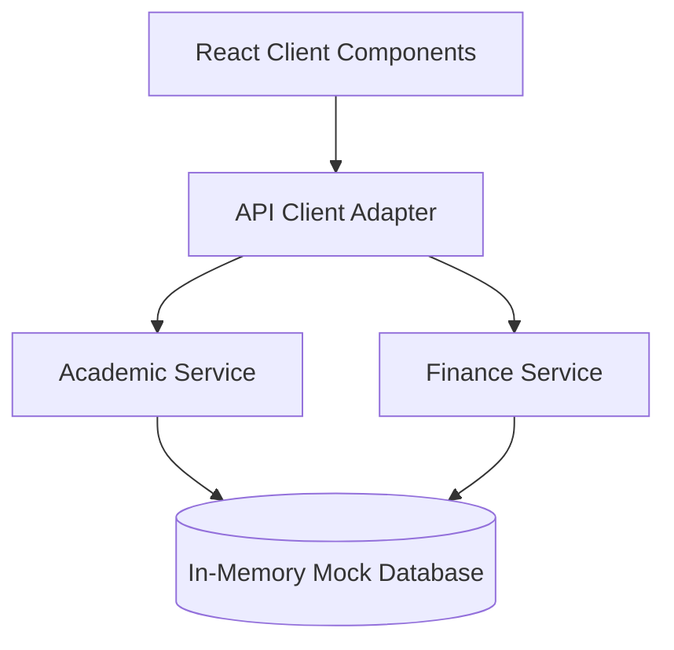

# 🎓 IMSEC College ERP Portal Clone — Architectural & Visual Showcase

> **High-Fidelity Educational Engineering Project**  
> **Author**: Rahul Singh (@Rahul-singh13)  
> **Stack**: React 18, Vite, Vanilla CSS Design System, Modular Mock Backend Service Layer

---

## 📌 1. Project Objective & Vision
- Recreate the full enterprise IMSEC College ERP Student Portal (`/academic`) with 100% visual fidelity and instant responsiveness.
- Eliminate dependency on fragile external networks by building a decoupled, offline mock backend architecture.
- Maintain top-tier code hygiene, strict security gating (no leaks of private credentials), and automated GitHub sync.

---

## 🏛️ 2. Design System & UI/UX Fidelity
- **Primary Navy Blue**: `#253973` for header branding and top metric widgets.
- **Active Navigation Amber/Yellow**: `#F8C12D` with `1.5px solid #000` active border.
- **Blinking Alert Indicators**: Animated emergency notices and circular notification pills.
- **Typography & Responsive Grids**: Clean sans-serif hierarchy matching native portal tables.

---

## 📸 3. Page Showcases
- **Dashboard**: Complete attendance donuts, performance charts, notices marquee, and quick links.
- **Attendance**: Subject-wise lecture attendance, percentage badges, and shortfall warning indicators.
- **Library**: Book catalog search, issue/return date tracking, and digital accession slips.
- **Admission**: Student bio-data, branch allocation, enrollment verification, and guardian records.

---

## 🛠️ 4. Technical Architecture

---

## 🎯 5. Conclusion
A production-grade, highly polished, zero-dependency educational clone that demonstrates modern React craftsmanship, clean state management, and enterprise-grade UI styling.
