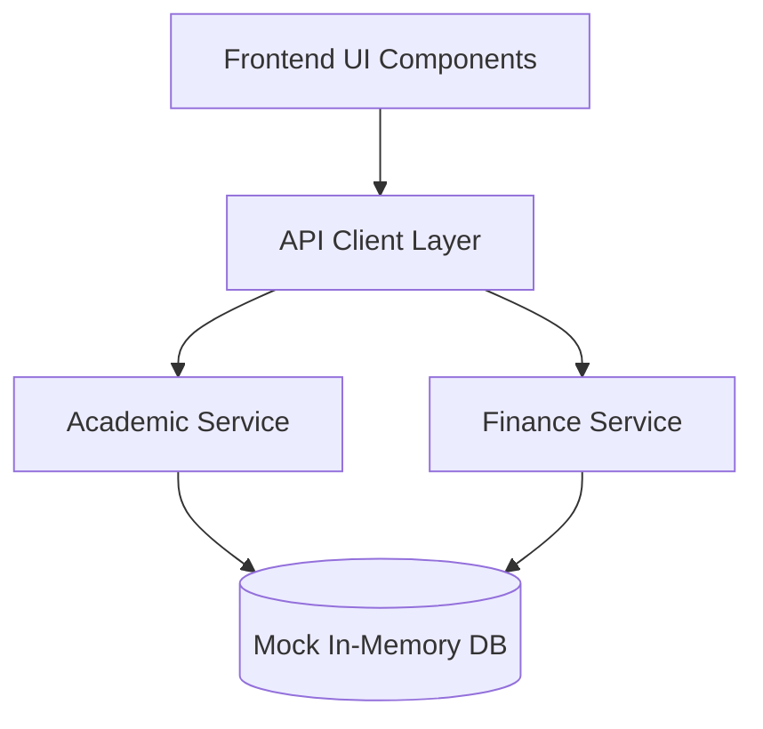

# 🎓 IMSEC COLLEGE ERP PORTAL — Architectural & Visual Showcase

> **Author**: Rahul Singh (@Rahul-singh13)
> **Tech Stack**: React, Vite, React Router
> **Modules**: 29 Views

---

## 📌 1. Project Overview
🎓 High-fidelity React 18.3.1 + Vite educational clone of IMSEC College ERP with 29 modules, decoupled mock backend services & vanilla design system.

---

## 🏛️ 2. Key Modules & Pages
- **AcademicPayment**
- **AdmissionProject**
- **AdmitCard**
- **AssignmentList**
- **BirthdayList**
- **ChangePassword**
- **CompanyList**
- **ComplaintList**
- **Dashboard**
- **DownloadForms**
- **Feedback**
- **GatePassList**
- **HostelRequest**
- **LibraryBook**
- **LogoutPage**
- **NoDuesList**
- **NoticeList**
- **OnlineTxn**
- **RfidRequest**
- **ScheduleWiseAttendance**

---

## 🛠️ 3. Architecture & Data Flow

---

## 🎯 4. Visual Verification
### Admission

### Attendance

### Dashboard

### Library

