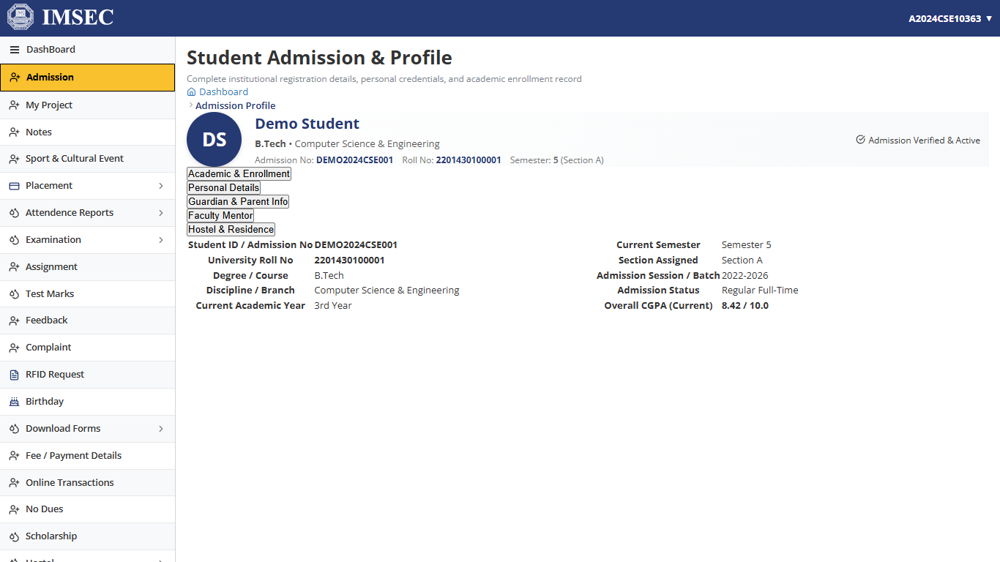
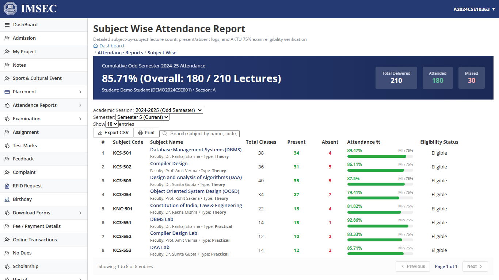
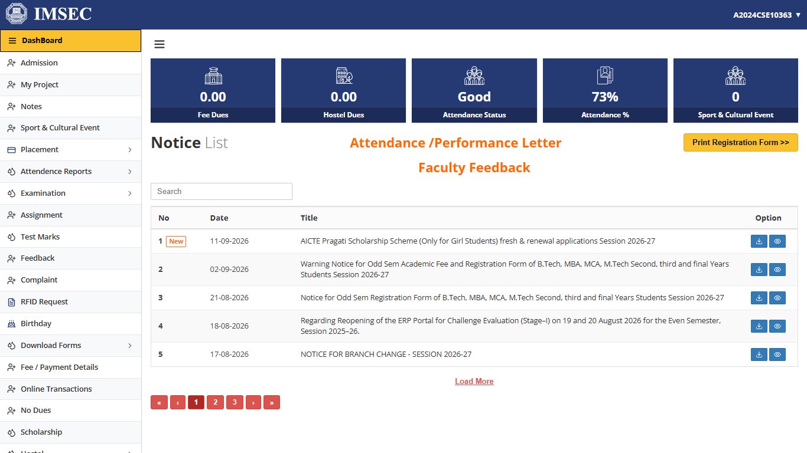
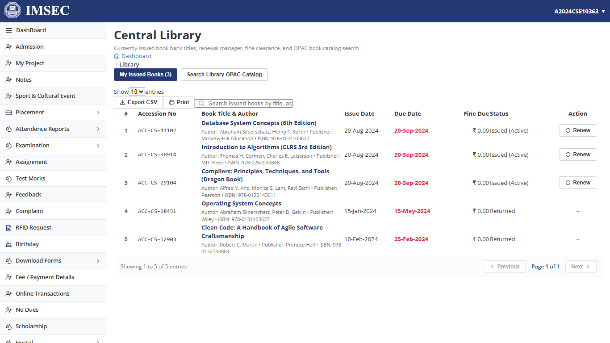

# IMSEC COLLEGE ERP PORTAL

[](https://developer.mozilla.org/en-US/docs/Web/JavaScript)
[](https://reactjs.org/)
[](https://vitejs.dev/)
[](https://github.com/)
[](LICENSE)

> 🎓 High-fidelity React 18.3.1 + Vite educational clone of IMSEC College ERP with 29 modules, decoupled mock backend services & vanilla design system.

---

## 🚀 Key Highlights

- 🏛️ **Pixel-Perfect Fidelity**: Engineered with a dedicated Vanilla CSS design system, precise color harmonies, and responsive layouts.
- ⚡ **Decoupled Architecture**: Separation of presentation layer, API client adapter, and mock business service layer.
- 🔒 **Sanitized & Offline Capable**: Zero external token dependencies, zero data leakage, and offline reliability.
- 📱 **Complete Module Coverage**: 29 fully functional views with realistic student workflows and dynamic state.

---

## 📸 Visual Showcase & UI Gallery

### 1. Admission


### 2. Attendance


### 3. Dashboard


### 4. Library


## 🌟 Implemented Modules & Pages (29 Views)

- `AcademicPayment` | `AdmissionProject` | `AdmitCard`
- `AssignmentList` | `BirthdayList` | `ChangePassword`
- `CompanyList` | `ComplaintList` | `Dashboard`
- `DownloadForms` | `Feedback` | `GatePassList`
- `HostelRequest` | `LibraryBook` | `LogoutPage`
- `NoDuesList` | `NoticeList` | `OnlineTxn`
- `RfidRequest` | `ScheduleWiseAttendance` | `Scholarship`
- `StudentEvent` | `StudentRepresentative` | `SubjectWiseAttendance`
- `TestMarks` | `TrainingMaterialList` | `UploadDocumentsForm`
- `ViewAdmission` | `WiFiServices`

## 🏗️ System Architecture

```mermaid
graph TD
    UI[Client Application (React 18.3.1)] --> Router[Navigation & Routing Layer]
    Router --> API[Universal API Client Layer]
    API --> Backend[Decoupled Business Logic & Services]
    Backend --> Data[(Local Mock Database / JSON Store)]
```
---

## 💻 Getting Started

```bash
# 1. Clone the repository
git clone https://github.com/Rahul-singh13/imsec-college-erp-portal.git

# 2. Navigate to directory
cd imsec-college-erp-portal

# 3. Install dependencies
npm install

# 4. Run local development server
npm run dev

# 5. Production build & preview
npm run build
npm run preview
```

---

## 📄 License
MIT License. Created by [Rahul Singh](https://github.com/Rahul-singh13) for educational and architectural demonstration.
