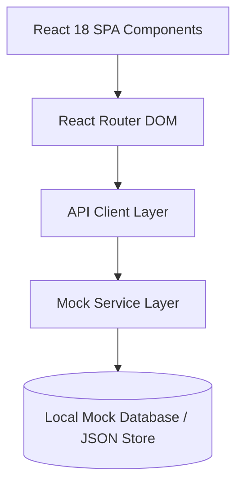

# {{PROJECT_NAME}}

[](https://reactjs.org/)
[](https://vitejs.dev/)
[](https://github.com/)
[](LICENSE)

> 🎓 **High-fidelity 100% pixel-perfect educational clone of the IMSEC College ERP Student Portal** (`/academic`). Built for offline reliability, performance, and demonstration of modern modular frontend architecture.

---

## 🌟 Key Highlights & Features

- 🏛️ **Pixel-Perfect ERP Portal**: Exact replication of IMSEC layout, color palette (#253973 Navy, #F8C12D Yellow active navigation), typography, blinking alerts, and pagination.
- ⚡ **Decoupled Architecture**: 
  - Mock database (`src/backend/mockDatabase.js`)
  - Academic & Finance services (`src/backend/academicService.js`, `src/backend/financeService.js`)
  - Universal API client (`src/api/apiClient.js`) with seamless switch between local mock data and live REST endpoints.
- 📱 **All 29 Routes Implemented**: Complete student workflows including Dashboard, Subject-wise Attendance, Fee Receipts, Library Books, Examination Admit Cards, Grievances, Gate Passes, and Hostel Management.
- 🔒 **Zero Hardcoded Secrets**: Fully sanitized, offline-capable, and secure.

---

## 📸 Visual Showcase

### 1. Academic Student Dashboard (`/academic`)


### 2. Subject-wise Attendance Tracker (`/subject_wise_attendence`)


### 3. Digital Library Portal (`/library_book`)


### 4. Student Admission Details (`/view_admission`)


---

## 🏗️ Architecture & Decoupled Design



---

## 🚀 Getting Started

```bash
# 1. Clone repository
git clone https://github.com/Rahul-singh13/imsec-college-erp-portal.git

# 2. Navigate to project
cd imsec-college-erp-portal

# 3. Install dependencies
npm install

# 4. Start local development server
npm run dev

# 5. Build for production
npm run build
```

---

## 📄 License
MIT License. Created for educational & architectural demonstration purposes.
